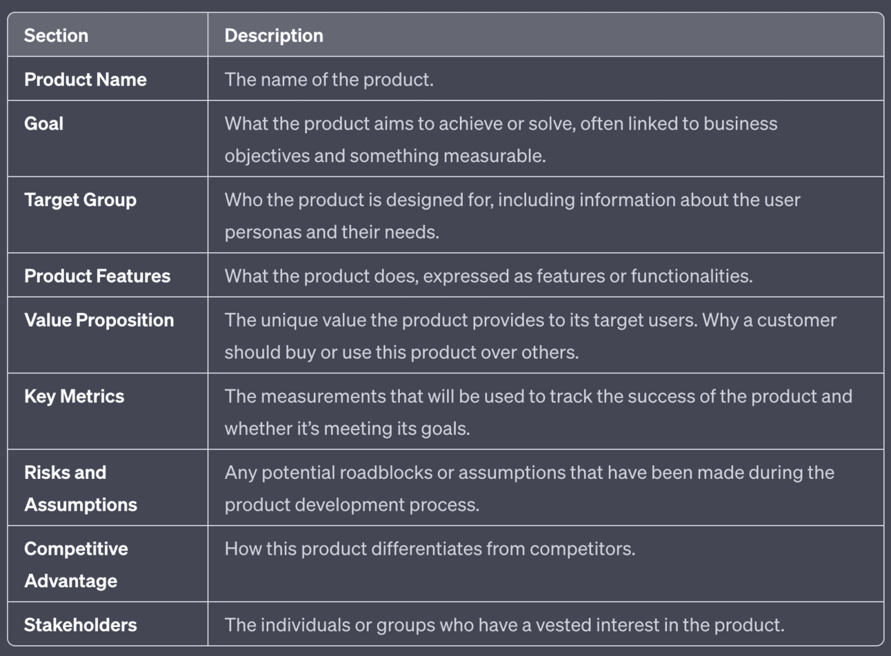

## 생성형 인공지능(Generative AI)
- 오디오, 코드, 이미지, 텍스트, 시뮬레이션, 동영상 등 새로운 콘텐츠를 만드는 데 사용할 수 있는 알고리즘(예:ChatGPT)을 말합니다.
- 최근 이 분야의 새로운 혁신은 콘텐츠 제작 방식을 크게 바꿀 수 있는 잠재력을 가지고 있습니다.
- <b>콘텐츠를 만드는 것은 많은 영역에서 사람에서 사람 기계 팀으로 빠른 속도로 대체하고 있읍니다.</b>
- 작업자는 창의력을 한 단계 더 끌어올릴 수 있습니다.
- 재미뿐만 아니라 새로운 제품 디자인을 만들고 비즈니스 프로세스를 최적화하는 등 실용적인 용도로도 많이 활용되고 있습니다.

## ChatGPT와 DALL-E
- 사전 학습된 생성형 트랜스포머의 약자
- OpenAI, 2022년 11월에 일반 대중을 대상으로 공개

## What is an action in a GPT?
- GPT action flow
- Open API

## 예 : Automotive R&D transformation
- Automotive R&D transformation: Optimizing gen AI’s potential value Automotive manufacturers could realize time and cost savings and quality improvements by implementing generative AI functions that add value at all stages of the R&D process
- 세 가지 중요한 트렌드가 자동차 산업의 R&D 기능에 영향을 미치고 있으며 
근본적인 변화가 필요합니다. 
    - 첫째, 내연기관(ICE)에서 전기 자동차(EV) 기술로의 전환은 유가 급등 이후 자동차 업계가 경험하지 못한 근본적인 변화입니다. 
        - 경쟁은 반세기 전부터 연비 효율이 높은 차량에 대한 수요를 촉발시켰습니다.
    - 두 번째는 소비자를 위한 중앙 아키텍처를 갖춘 소프트웨어 정의 차량의 트렌드입니다. 
        - 소프트웨어는 자동차 업체들에게 많은 차별화할 수 있는 기회를 인포테인먼트 및 첨단 운전자 지원 시스템과 같은 애플리케이션을 통해 
및 첨단 운전자 지원 시스템과 같은 애플리케이션을 통해 차별화할 수 있습니다. 
        - 하지만 소프트웨어는 기업들에게 소프트웨어 제공업체로서의 추가 역할을 지원하기 위해 하드웨어 중심의 운영을 혁신해야 하는 상당한 과제를 안겨주기도 합니다.
    - 세 번째 트렌드는 생성형 AI(gen AI)의 등장입니다. 
        - 생성형 AI는 강력한 기술로 자리 잡고 있으며 R&D 팀의 운영 방식을 완전히 재구성할 수 있는 잠재력을 지닌 강력한 기술이 되고 있습니다.
        - 이 기술은 아직 아직 초기 단계이지만, 언어와 이미지를 생성하고 처리하며 언어 및 이미지 생성 및 처리, 다양한 소스에서 얻은 인사이트 통합 
다양한 소스, 다양한 형식의 정보 처리 다양한 형식의 정보를 처리하고 **규제 목적의 상세한 문서를 생성하는 능력**은 R&D의 미래를 근본적으로 바꿔놓을 수 있음을 시사합니다.

### Testing and homologation. 
 
- 테스트 및 인증 
    - gen AI를 사용하여 보고를 자동화하고 문서화 및 시나리오 기반 시뮬레이션이 테스트 및 승인 프로세스를 20~30% 개선할 수 있을 것으로 예상했습니다. 
    - 자동화는 필수 보고서, 매뉴얼, 문서 작성을 간소화하여 필수 보고서, 매뉴얼 및 문서 규정 준수, 제품 문서화 및 품질 보증 목적.
- 그리고 일부 사용 사례는 탁월한 효율성: 
    - 예를 들어 독일의 한 티어1 자동차 공급업체는 생산성을 70% 향상시켰습니다. 
    - 인간 검토 시간을 포함해 70%의 생산성 향상을 달성했습니다.
    - gen AI를 사용하여 다음과 같은 테스트 벡터를 생성함으로써 다음과 같은 생산성 향상을 달성했습니다. 
    - 전체 분기 커버리지 및 수정된 조건/결정 범위(MCDC)와 같은 테스트 벡터를 생성하여 생산성을 향상했습니다. 
    - 개발 프로세스에 gen AI를 임베디드 개발 프로세스에 통합하여 소프트웨어 및 요구 사항 생성 이해관계자 요청에 대한 요구 사항 결정을 돕기 위해 
요구 사항을 결정하는 데 도움을 주기 위해 첫 번째 초안 
    - 이 회사는 엔지니어의 생산성 최대 30%의 생산성 향상을 달성했습니다.

- 디자인 애플리케이션:
    - R&D의 설계 부문 
        - R&D 부문의 리더들은 제너레이티브 디자인 사용 사례를 통해 R&D 프로세스를 10~20% 개선할 수 있을 것으로 예상했습니다.
        - 또한 **리버스 엔지니어링 및 블랙박스 엔지니어링 사용 사례**를 통해 R&D 프로세스를 5 ~ 10 R&D 프로세스를 5~10% 개선할 수 있을 것으로 예상했습니다. 
        - 제너레이티브 AI를 사용하여 지식 추출 및 해독과 같은 독점적인 지식 추출과 같은 기술 알고리즘 디코딩 또는 리엔지니어링

- **이 분야에 새롭게 진입한 전기차 제조업체들, 즉 중국, 미국 및 기타 지역의 전기차 제조업체들은 이미 성공적으로 구현된 R&D 프로세스 혁신으로 신차 출시 기간을 단축하고 시장 출시 시간을 단축하는 R&D 프로세스 혁신을 성공적으로 구현하여 이미 마진이 압박받고 있는 기존 업체들에 비해 상당한 전략적 이점을 확보하고 있습니다.**

### Product Descriptions 
If have a product or service and are using ChatGPT mainly for work around this product (ideation, brainstorming, content), then it could be very useful to add context for this product into the custom instructions box.

You can use this product canvas as a template:

## 
- The market outlook for tricycles is

Tricycles have traditionally been associated with children's toys and transportation for individuals with mobility issues. However, in recent years, there has been a growing interest in adult tricycles for various purposes, including recreation, fitness, and eco-friendly commuting.

Key factors influencing the market outlook for tricycles may include:

1. Demographic Trends: An aging population in many countries could drive demand for adult tricycles as a form of mobility assistance for older adults.

2. Urbanization: As cities become more congested and polluted, there could be increased interest in alternative modes of transportation like tricycles, especially for short-distance commuting or running errands.

3. Health and Fitness Trends: Adult tricycles can appeal to individuals looking for low-impact exercise options or those with mobility limitations who still want to stay active.

4. Environmental Concerns: With a growing emphasis on sustainability and reducing carbon footprints, there may be increased interest in tricycles as a zero-emission mode of transportation.

5. Technological Advancements: Innovation in materials, design, and electric-assist technologies could make tricycles more appealing and accessible to a broader range of consumers.

6. Economic Factors: The affordability and accessibility of tricycles compared to traditional bicycles or automobiles could influence consumer choices, especially in regions where income levels vary.

7. Regulatory Environment: Government policies regarding bicycle infrastructure, road safety, and electric vehicle incentives could impact the adoption and usage of tricycles.

### 세발자전거 시장을 요약하면 다음과 같습니다.

1. 다양한 용도: 세발자전거는 어린이 장난감, 장애인을 위한 이동 보조 기구 등 다양한 용도로 사용되며 점점 더 성인을 위한 대체 교통 수단으로 사용되고 있습니다.
2. 세분화: 세발자전거 시장은 전통적인 페달 구동 세발자전거, 전기 세발자전거(e-trike), 화물용 세발자전거, 노인이나 개인과 같은 특정 인구통계를 위한 특수 모델 등 용도에 따라 다양한 카테고리로 분류됩니다. 장애가 있는.
3. 시장 동인: 세발자전거 시장을 이끄는 주요 요인에는 인구통계학적 추세(인구 노령화), 도시화 및 혼잡, 건강 및 피트니스 추세, 환경 문제, 기술 발전(예: 전기 보조 기술), 경제적 요인 및 정부 정책과 인센티브.
4. 지역적 차이: 시장 역학은 문화, 인프라, 규정 및 소비자 선호도의 차이로 인해 지역별로 크게 다를 수 있습니다. 예를 들어, 일부 지역에서는 라스트마일 배송을 위해 화물 세발자전거에 대한 수요가 더 높을 수 있는 반면, 다른 지역에서는 도시 통근을 위해 전기 세발자전거를 우선시할 수 있습니다.
5. 혁신과 경쟁: 세발자전거 제조업체는 성능, 편안함, 안전 및 지속 가능성을 개선하기 위해 지속적으로 혁신하고 있습니다. 국내외 제조업체 간의 경쟁은 혁신을 촉진하고 시장 성장을 주도합니다.
6. 지속 가능성 및 환경 문제: 세발자전거, 특히 전기 모델은 점점 더 전통적인 자동차에 대한 환경 친화적인 대안으로 인식되어 탄소 배출을 줄이고 대기 오염을 방지하려는 노력에 기여하고 있습니다.
7. 정부 지원 및 규제: 정부 정책, 인센티브 및 규정은 세발자전거 시장을 형성하는 데 중요한 역할을 합니다. 보조금, 세금 감면, 인프라 투자, 안전 및 배출 관련 규제는 소비자 채택과 산업 성장에 영향을 미칠 수 있습니다.

### 세발자전거를 활용한 모빌리티 서비스 시장은 독특한 기회와 도전을 제공하는 신흥 분야입니다. 세발자전거를 활용한 모빌리티 서비스 시장 전망은 다음과 같다.

#### 도시 이동성 솔루션: 세발자전거는 특히 단거리 여행이나 최종 마일 운송을 위한 이동성 솔루션을 제공하기 위해 도시 지역에서 점점 더 많이 사용되고 있습니다. 모빌리티 서비스 제공업체는 자전거 공유 프로그램과 유사한 세발자전거 공유 서비스를 제공하여 통근자가 혼잡한 도시 거리를 탐색하고 목적지에 보다 효율적으로 도달할 수 있도록 돕습니다.
#### 접근성 및 포괄성: 세발자전거는 안정성을 제공하고 노인과 장애인을 포함하여 이동성이 제한된 라이더를 수용할 수 있기 때문에 자전거나 스쿠터에 비해 더 접근하기 쉽고 포용적인 교통 수단이 될 수 있습니다. 모빌리티 서비스 제공업체는 전기 보조 모터나 쇼핑 여행을 위한 화물 공간 등 다양한 기능을 갖춘 세발자전거를 제공하여 다양한 사용자 요구를 충족할 수 있습니다.
#### 관광 및 레크리에이션: 세발자전거는 관광 및 레크리에이션 목적으로도 활용될 수 있으며, 도시 랜드마크, 공원 및 경치 좋은 길을 탐험하기 위한 가이드 투어 또는 렌탈 서비스를 제공합니다. 모빌리티 서비스 제공업체는 인기 있는 관광지에서 세발자전거 기반 투어 및 렌탈 서비스를 제공함으로써 독특하고 친환경적인 여행 경험에 대한 수요 증가를 활용할 수 있습니다.
#### 대중교통과의 통합: 세발자전거는 통근자를 위한 첫 번째 마일과 마지막 마일 연결 옵션을 제공함으로써 기존 대중교통 시스템을 보완할 수 있습니다. 모빌리티 서비스 제공업체는 대중교통 기관과 협력하여 세발자전거 공유 서비스를 버스 및 기차 노선과 통합하여 도시 주민과 방문객에게 원활한 다중 모드 교통 솔루션을 제공할 수 있습니다.
#### 도전과제 및 고려사항: 잠재적인 이점에도 불구하고 삼륜차를 활용한 모빌리티 서비스 시장에서는 고려해야 할 몇 가지 과제가 있습니다. 여기에는 지정된 주차 및 충전소의 필요성, 도로 안전 및 라이센스 요구 사항과 관련된 규제 장애물, 전기 스쿠터 및 공유 자전거와 같은 기타 마이크로 모빌리티 옵션과의 경쟁과 같은 인프라 제한이 포함됩니다.
#### 지속 가능성 및 환경에 미치는 영향: 세발자전거, 특히 전기 모델은 탄소 배출을 줄이고 도시 지역의 교통 혼잡을 완화하는 데 도움이 될 수 있는 지속 가능하고 친환경적인 교통 수단을 제공합니다. 모빌리티 서비스 제공업체는 세발자전거의 환경적 이점을 활용하여 환경에 관심이 있는 소비자를 유치하고 경쟁적인 모빌리티 시장에서 차별화할 수 있습니다.

#### 전반적으로 세발자전거를 활용한 모빌리티 서비스 시장은 특히 효율적이고 접근 가능하며 지속 가능한 교통 솔루션에 대한 수요가 증가하는 도시 지역에서 혁신과 성장을 위한 유망한 기회를 제시합니다. 주요 과제를 해결하고 세발자전거의 고유한 장점을 활용함으로써 모빌리티 서비스 제공업체는 미래를 형성하는 데 중추적인 역할을 할 수 있습니다.

## 자율주행 기술을 활용한 개인교통 시장은 상당한 성장과 변화를 맞이할 준비가 되어 있습니다. 이 시장에 대한 전망은 다음과 같습니다.

1. 기술 발전: 자율 주행 기술은 자동차 및 기술 산업의 주요 업체들이 연구 개발에 막대한 투자를 하면서 계속해서 빠르게 발전하고 있습니다. 기술이 성숙해짐에 따라 도시 환경과 복잡한 교통 상황을 포함하여 더 넓은 범위의 운전 시나리오를 처리할 수 있는 더욱 정교한 자율 시스템을 기대할 수 있습니다.
2. 안전성 및 효율성: 자율 주행 기술의 주요 동인 중 하나는 도로 안전을 향상하고 교통 사고를 줄일 수 있는 잠재력입니다. 자율주행차(AV)는 센서, 카메라, 인공지능을 활용해 도로를 안전하게 주행함으로써 사고의 주요 원인인 사람의 실수를 제거할 수 있는 잠재력을 가지고 있습니다. 또한 AV는 서로 통신하고 이동을 보다 효율적으로 조정하여 교통 흐름을 최적화하고 혼잡을 줄일 수 있습니다.
3. 도시 이동성 솔루션: 자율주행 차량은 도시 이동성의 미래를 형성하는 데 중요한 역할을 할 것으로 예상됩니다. 자율주행차 및 자율주행 셔틀과 같은 개인 자율주행차는 도시 거주자에게 편리하고 유연한 교통 옵션을 제공하여 개인차 소유 필요성과 기존 대중교통 시스템에 대한 의존도를 줄일 수 있습니다.
4. 공유 모빌리티 서비스: 자율 주행 기술은 자율 주행 및 차량 공유 플랫폼과 같은 공유 모빌리티 서비스의 새로운 모델을 가능하게 합니다. Uber, Lyft, Waymo와 같은 회사는 운전자 없이도 주문형 운송 서비스를 제공하기 위해 자율주행차 기술에 투자하고 있습니다. 공유 자율주행차는 교통 접근성을 향상하고, 비용을 절감하며, 도시 지역의 주차 부족을 완화할 수 있는 잠재력을 가지고 있습니다.
5. 규제 환경: 자율 주행 기술의 광범위한 채택은 안전과 규정 준수를 보장하기 위한 명확한 규정 및 표준의 개발에 달려 있습니다. 전 세계 정부와 규제 기관은 자율주행차의 테스트, 인증, 배포를 위한 프레임워크를 구축하기 위해 노력하고 있습니다. 업계 이해관계자 간의 규제 지원과 협력은 자율주행차를 기존 교통 시스템에 성공적으로 통합하는 데 매우 중요합니다.
6. 소비자 수용: 자율 주행 기술에 대한 대중의 인식과 수용도 개인 교통 시장을 형성하는 데 중요한 역할을 할 것입니다. 일부 소비자는 자율주행차의 잠재적 이점에 열광하는 반면, 다른 소비자는 안전, 개인 정보 보호 및 운송 부문의 기존 직업에 미치는 영향에 대해 우려하고 있습니다. 교육, 투명성, 실제 시연을 통해 자율주행 기술에 대한 신뢰와 확신을 구축하는 것은 광범위한 채택에 필수적입니다.

- 전반적으로 자율주행 기술을 활용한 개인 교통 시장은 미래에 사람들이 이동하고 통근하는 방식을 혁신할 수 있는 엄청난 잠재력을 가지고 있습니다. 기술이 계속 발전하고 성숙해짐에 따라 안전과 효율성을 제공하는 자율주행차와 혁신적인 모빌리티 솔루션의 채택이 증가할 것으로 예상됩니다.

1. 신흥 기술: 자율 주행 전기 스쿠터는 자율 주행 기능과 전기 추진력을 결합하여 편리하고 친환경적인 개인 이동 수단을 제공합니다. 자율주행 기술은 주로 자동차와 관련이 있었지만, 도시 지역의 단거리 이동을 위해 스쿠터와 같은 소형 차량에 적용하려는 관심이 높아지고 있습니다.
2. 도시 이동성 솔루션: 자율 주행 전기 스쿠터는 기존 자동차 기반 교통 수단에 유연하고 효율적인 대안을 제공함으로써 도시 혼잡과 오염 문제를 해결할 수 있는 잠재력을 가지고 있습니다. 이 스쿠터는 도시 거리를 자율적으로 탐색할 수 있어 통근자에게 첫 번째 마일과 마지막 마일 연결성을 제공하고 개인 차량 소유의 필요성을 줄입니다.
3. 마이크로 모빌리티 트렌드: 전기 스쿠터, 자전거 등 마이크로 모빌리티 서비스의 증가로 인해 자율 주행 전기 스쿠터가 공유 모빌리티 차량의 일부로 시장에 진입할 수 있는 기회가 생겼습니다. 스쿠터 공유 서비스를 제공하는 회사는 차량 관리를 개선하고 운영 비용을 절감하며 사용자 경험을 향상시키기 위해 자율 주행 스쿠터를 배포하는 것의 가치를 확인할 수 있습니다.
4. 기술적 과제: 자율 주행 전기 스쿠터를 개발하는 것은 센서 통합, 장애물 감지, 복잡한 도시 환경에서의 내비게이션 등 독특한 기술적 과제를 제시합니다. 이 분야에서 일하는 회사들은 이러한 과제를 극복하고 자율 스쿠터 시스템의 안전성과 신뢰성을 보장하기 위해 연구 개발에 투자하고 있습니다.
5. 규제 고려 사항: 다른 자율 주행 차량과 마찬가지로 자율 주행 전기 스쿠터도 규제 요구 사항 및 안전 표준을 준수해야 합니다. 정부와 규제 기관은 여전히 ​​자율 마이크로 모빌리티 차량의 테스트 및 배포를 위한 프레임워크를 정의하는 과정에 있으며, 이는 시장 성장 및 채택 속도에 영향을 미칠 수 있습니다.
6. 경쟁 및 협력: 자율 주행 전기 스쿠터 시장은 마이크로 모빌리티 산업의 기존 플레이어뿐만 아니라 자율 기술에 초점을 맞춘 신규 진입자 간의 경쟁을 보게 될 가능성이 높습니다. 기술 기업, 스쿠터 제조업체, 모빌리티 서비스 제공업체 간의 협력을 통해 혁신과 시장 침투가 가속화될 수 있습니다.
소비자 수용: 자율 주행 전기 스쿠터에 대한 대중의 인식과 수용은 시장 성공에 매우 중요합니다. 자율 기술에 대한 신뢰와 확신을 구축하고, 안전 문제를 해결하고, 긍정적인 사용자 경험을 보장하는 것이 공동 운전의 핵심 요소가 될 것입니다.