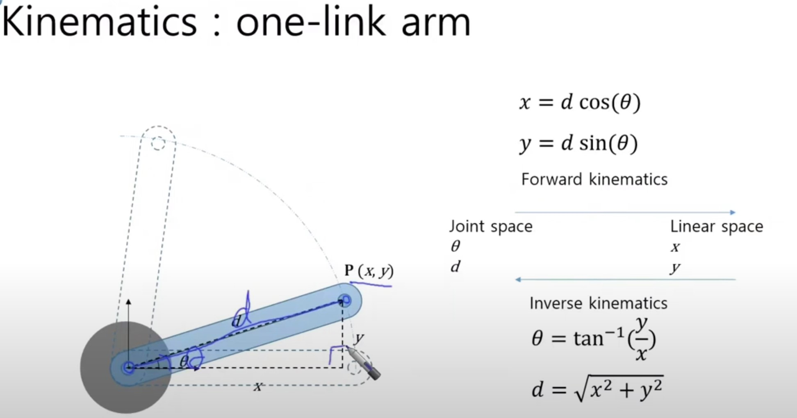
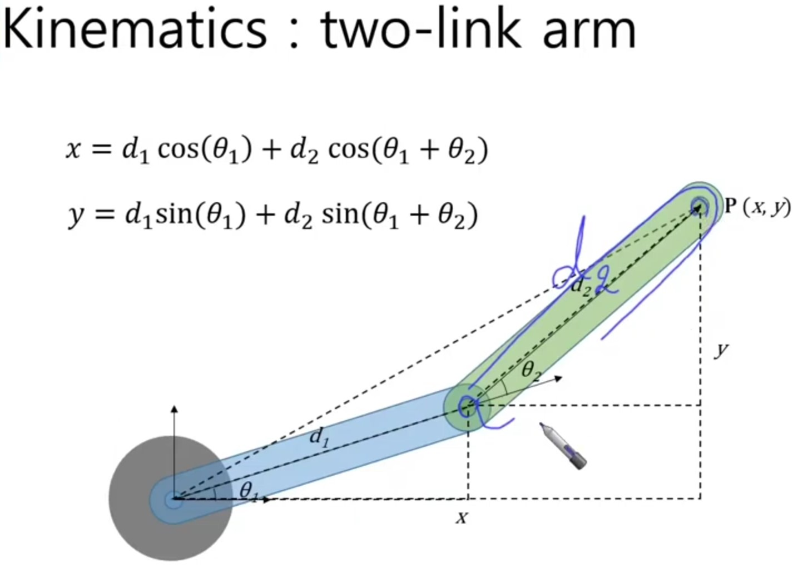

### Robotics based on LLMs
- Robotics + LLM => Embodied Intelligence / Agents
- Q-Transformer : reinforcement learning + Transformer

## arm sim

arm, d 길이(m), a 각도, x, y
            d*sin(d*pi/180), d*cos(d*pi/180)
p1
p2

